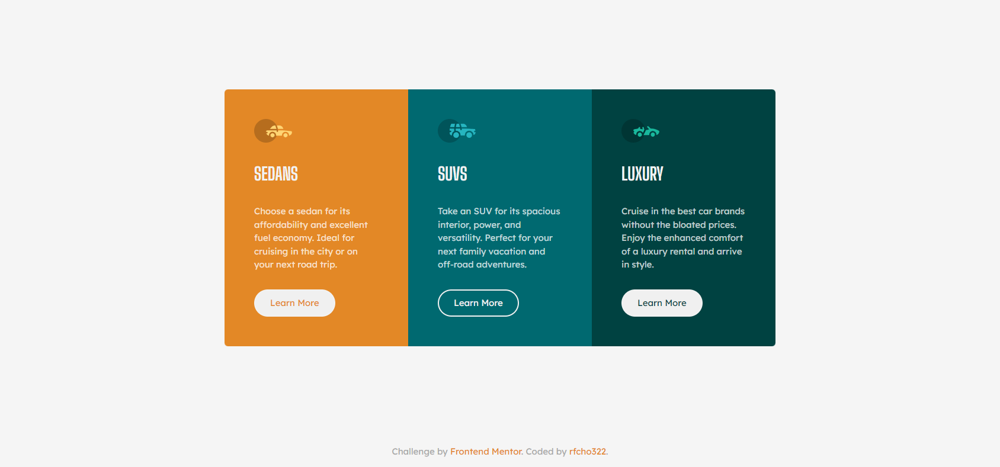

# Frontend Mentor - 3-column preview card component solution

This is a solution to the [3-column preview card component challenge on Frontend Mentor](https://www.frontendmentor.io/challenges/3column-preview-card-component-pH92eAR2-).

## Table of contents

- [Overview](#overview)
  - [The challenge](#the-challenge)
  - [Screenshot](#screenshot)
  - [Links](#links)
- [My process](#my-process)
  - [Built with](#built-with)
- [Author](#author)

## Overview

### The challenge

Users should be able to:

- &#9989; View the optimal layout depending on their device's screen size
- &#9989; See hover states for interactive elements

### Screenshot

  <strong>Desktop</strong>

  

  <strong>Mobile</strong>

  

### Links

- Frontend Mentor solution URL: [3 Column Card Component Solution](https://www.frontendmentor.io/solutions/3column-preview-card-component-cFMvmr4x1b)
- Live Site URL: [3 Column Card Component Live Website](https://rfcho322.github.io/fem-three-column-component/)

## My process

### Built with

- Semantic HTML5 markup
- CSS custom properties
- Flexbox
- CSS Grid
- Mobile-first workflow

## Author

- Frontend Mentor - [@rfcho322](https://www.frontendmentor.io/profile/rfcho322)
